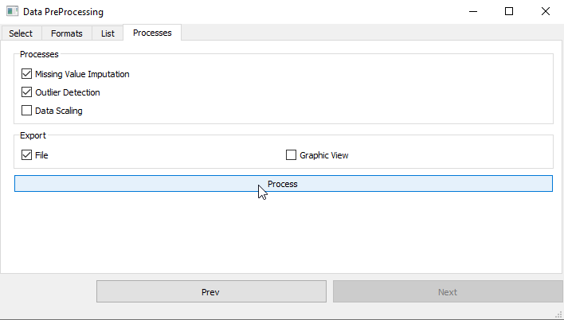
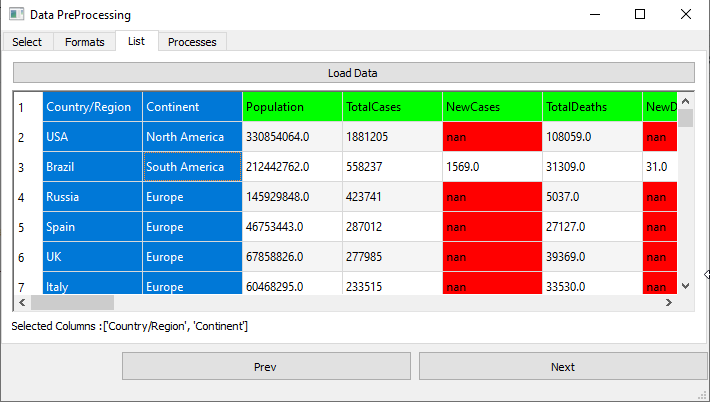

<!--
*** Thanks for checking out the Best-README-Template. If you have a suggestion
*** that would make this better, please fork the repo and create a pull request
*** or simply open an issue with the tag "enhancement".
*** Thanks again! Now go create something AMAZING! :D
-->


<!-- PROJECT SHIELDS -->
<!--
*** I'm using markdown "reference style" links for readability.
*** Reference links are enclosed in brackets [ ] instead of parentheses ( ).
*** See the bottom of this document for the declaration of the reference variables
*** for contributors-url, forks-url, etc. This is an optional, concise syntax you may use.
*** https://www.markdownguide.org/basic-syntax/#reference-style-links
-->
[![Contributors][contributors-shield]][contributors-url]
[![Forks][forks-shield]][forks-url]
[![Stargazers][stars-shield]][stars-url]
[![Issues][issues-shield]][issues-url]
[![MIT License][license-shield]][license-url]
[![LinkedIn][linkedin-shield]][linkedin-url]


<!-- PROJECT LOGO -->
<br />
<p align="center">

  <h3 align="center">Data Preprocessing Form Project with PyQt5</h3>

  <p align="center">
    Easily select your file, define missing and delimiter formats, list features, process and visualize them! 
  </p>
</p>


<!-- TABLE OF CONTENTS -->
<details open="open">
  <summary>Table of Contents</summary>
  <ol>
    <li>
      <a href="#about-the-project">About the Project</a>
    </li>
    <li>
      <a href="#getting-started">Getting Started</a>
      <ul>
        <li><a href="#prerequisites">Prerequisites</a></li>
      </ul>
    </li>
    <li>
      <a href="#usage">Usage</a>
      <ul>
        <li><a href="#select-file">Select File</a></li>
        <li><a href="#define-formats">Define Formats</a></li>
        <li><a href="#list-the-features">List the Features</a></li>
        <li><a href="#pre-processing">Pre Processing</a></li>
        <li><a href="#visualize">Visualize</a></li>
      </ul>
    </li>
    <li><a href="#contributing">Contributing</a></li>
    <li><a href="#license">License</a></li>
    <li><a href="#contact">Contact</a></li>
  </ol>
</details>


<!-- ABOUT THE PROJECT -->
## About The Project
This project eases the data preprocessing progress with static file read.  

Users are able to use this module not only data preproces but also data read and list the file inside like pd.read_csv. As noticed, only csv file formats are allowed now. 

Benefits of using this module
```
* Data visulalization with pd.read_csv in python.
* Missing value detection
* Outlier (IQR) detection 
* Scale (std) process 
* Export by file and graphics view
```
in any .csv file apart from its # of columns.

<!-- GETTING STARTED -->
## Getting Started
All of the files including images and design are necessary to be executed the module. 

### Prerequisites
This is an example of how to list things you need to use the software and how to install them.
* PyQt5
  ```python
    pip install PyQt5
    conda install -c anaconda pyqt
  ```
* Qt Designer (Optional)
  ```python
    pip install pyqt5-tools
  ```
 
<!-- USAGE EXAMPLES -->
## Usage
5 steps to be needed to complete the progress.

<!-- USAGE EXAMPLES -->
## Select File
<p align="center">
  
</p> 
Users can easily select .csv formatted files by browse button in this screen. 

## Define Formats
<p align="center">
  
</p> 

Missing formats predefined, however depending on user choise, this formats might be extended with comma seperated values, _i.e. nane,null1,null2,nan_.  

Seperator is the delimiter parameter of read_csv function. Mostly used delimiter formats added to this section.

## List the Features
<p align="center">
  
</p> 
With the "Load Data" button, selected file would be listed here. 

Green labels indicate the headers, which are compulsory, red labels show the missing datas in data depending on user's choise on previous section.

Before the next step, users must select the columns by clicking any item in list. Column will automatically selected and showed below then.

## Pre Processing
<p align="center">
  
</p> 
Three preprocessing functions valid here.

**Missing Value Imputation** detects the missing values in the list and impute them by SimpleImputer. 

Numerical values are imputed by mean whereas categorical ones are imputed by most_frequent method.

_For detail information, please see the [SimpleImputer](https://scikit-learn.org/stable/modules/generated/sklearn.impute.SimpleImputer.html)_.

```python
      num_imp = SimpleImputer(missing_values=np.nan, strategy='mean')
      cat_imp = SimpleImputer(missing_values=np.nan, strategy='most_frequent')
```

**Outlier Detection** finds the values not belonging the bounds by IQR method and drop them.

_For detail information, please see the [Interquartile_range](https://en.wikipedia.org/wiki/Interquartile_range)_.

```python
      q25, q75 = np.quantile(out_data, 0.25), np.quantile(out_data, 0.75)
      iqr = q75 - q25
      cut_off = iqr * 1.5
      lower, upper = q25 - cut_off, q75 + cut_off
```

**Data Scaling** standardize the values to unit variance. 

_For detail information, please see the [StandardScaler](https://scikit-learn.org/stable/modules/generated/sklearn.preprocessing.StandardScaler.html)_.

```python
      scaler = preprocessing.StandardScaler()
      self.scale_frame[col_name] = scaler.fit_transform(np.reshape(self.dataframe[col_name].values, (-1, 1)))
```

## Visualize
2 ways to export the results might be handled. 
**File Export** creates the new file with imputation values as previous selected file.

**Graphic View** enables users to export the results (selected columns) with scatter plots. Hence, users can be able to get which values dropped or scaled.

<p align="center">
  
</p> 


<!-- CONTRIBUTING -->
## Contributing

Contributions are what make the open source community such an amazing place to be learn, inspire, and create. Any contributions you make are **greatly appreciated**.

1. Fork the Project
2. Create your Feature Branch (`git checkout -b feature/AmazingFeature`)
3. Commit your Changes (`git commit -m 'Add some AmazingFeature'`)
4. Push to the Branch (`git push origin feature/AmazingFeature`)
5. Open a Pull Request


<!-- LICENSE -->
## License

Distributed under the MIT License. See `LICENSE` for more information.


<!-- CONTACT -->
## Contact

Project Link: [https://github.com/orkunkus/data_preprocessing_form_module_pyqt5](https://github.com/orkunkus/data_preprocessing_form_module_pyqt5)

Mail: orkunkus@yahoo.com


<!-- MARKDOWN LINKS & IMAGES -->
<!-- https://www.markdownguide.org/basic-syntax/#reference-style-links -->
[contributors-shield]: https://img.shields.io/github/contributors/orkunkus/data_preprocessing_form_module_pyqt5.svg?style=for-the-badge
[contributors-url]: https://github.com/orkunkus/data_preprocessing_form_module_pyqt5/graphs/contributors
[forks-shield]: https://img.shields.io/github/forks/orkunkus/data_preprocessing_form_module_pyqt5.svg?style=for-the-badge
[forks-url]: https://github.com/orkunkus/data_preprocessing_form_module_pyqt5/network/members
[stars-shield]: https://img.shields.io/github/stars/orkunkus/data_preprocessing_form_module_pyqt5.svg?style=for-the-badge
[stars-url]: https://github.com/orkunkus/data_preprocessing_form_module_pyqt5/stargazers
[issues-shield]: https://img.shields.io/github/issues/orkunkus/data_preprocessing_form_module_pyqt5.svg?style=for-the-badge
[issues-url]: https://github.com/orkunkus/data_preprocessing_form_module_pyqt5/issues
[license-shield]: https://img.shields.io/github/license/orkunkus/data_preprocessing_form_module_pyqt5.svg?style=for-the-badge
[license-url]: https://github.com/orkunkus/data_preprocessing_form_module_pyqt5/blob/main/LICENSE
[linkedin-shield]: https://img.shields.io/badge/-LinkedIn-black.svg?style=for-the-badge&logo=linkedin&colorB=555
[linkedin-url]: https://linkedin.com/in/orkunkus
[product-screenshot]: images/preprocess.png
